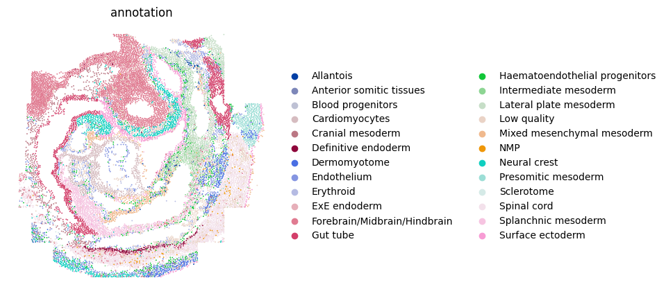
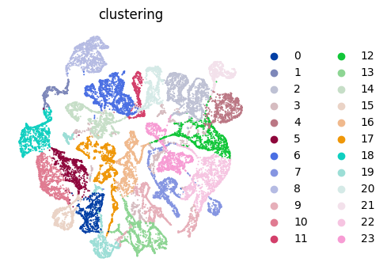

# Tutorial 3: Application on SeqFISH mouse embryo dataset. 
In this vignette, We performed `PROST` on the processed mouse embryo ST data from [(Lohoff, T. et al. 2022)](https://doi.org/10.1038/s41587-021-01006-2) generated by [SeqFISH](https://spatial.caltech.edu/seqfish/) to evaluate its general applicability.  
The original data can be downloaded from [google drive](https://drive.google.com/drive/folders/1r5Cuo4YqZVtFPpB-VqDoHkMW6vhl9glf?usp=share_link). 

---

## Identify SVGs
### 1.Load PROST and its dependent packages

    import pandas as pd 
    import numpy as np 
    import scanpy as sc 
    import os 
    import warnings 
    warnings.filterwarnings("ignore") 
    import matplotlib as mpl 
    import matplotlib.pyplot as plt 
    import PROST 
    PROST.__version__ 

    >>> ' 1.1.2 '

### 2.Set up the working environment and import data 

    # the location of R (used for the mclust clustering)
    ENVpath = "your path of PROST_ENV"            # refer to 'How to use PROST' section  
    os.environ['R_HOME'] = f'{ENVpath}/lib/R'
    os.environ['R_USER'] = f'{ENVpath}/lib/python3.7/site-packages/rpy2'
    
    # init
    SEED = 818
    PROST.setup_seed(SEED)
    
    # Set directory (If you want to use additional data, please change the file path)
    rootdir = 'datasets/SeqFISH/'
    
    input_dir = os.path.join(rootdir)
    output_dir = os.path.join(rootdir,'results/')
    if not os.path.isdir(output_dir):
        os.makedirs(output_dir)

    # Read counts and metadata
    counts = pd.read_csv(input_dir + "counts.txt", sep = "\t")
    metadata = pd.read_csv(input_dir + "metadata.txt", sep = "\t")
    gene_name = counts.index

    # Create anndata for embryo1 (embryo2 or embryo3)
    '''Embryo1'''
    metadata_embryo1 = metadata[metadata["embryo"]=="embryo1"]
    counts_embryo1 = counts.loc[:,metadata_embryo1["uniqueID"]]
    spatial_embryo1 = metadata_embryo1[["x_global","y_global"]]
    spatial_embryo1.index = metadata_embryo1["uniqueID"]

    # Create anndata
    adata = sc.AnnData(counts_embryo1.T)
    adata.var_names_make_unique()
    # read spatial
    adata.obsm["spatial"] = spatial_embryo1.to_numpy()

    # read annotation
    annotation = metadata_embryo1["celltype_mapped_refined"]
    annotation.index = metadata_embryo1["uniqueID"]
    adata.obs["annotation"] = annotation
    adata.write_h5ad(output_dir+"/used_data1.h5")

    '''Embryo2'''
    # metadata_embryo2 = metadata[metadata["embryo"]=="embryo2"]
    # counts_embryo2 = counts.loc[:,metadata_embryo2["uniqueID"]]
    # spatial_embryo2 = metadata_embryo2[["x_global","y_global"]]
    # spatial_embryo2.index = metadata_embryo2["uniqueID"]

    # # Create anndata
    # adata = sc.AnnData(counts_embryo2.T)
    # adata.var_names_make_unique()
    # # read spatial
    # adata.obsm["spatial"] = spatial_embryo2.to_numpy()
    # # read annotation
    # annotation = metadata_embryo2["celltype_mapped_refined"]
    # annotation.index = metadata_embryo2["uniqueID"]
    # adata.obs["annotation"] = annotation
    # adata.write_h5ad(output_dir+"/used_data2.h5")

    '''Embryo3'''
    # metadata_embryo3 = metadata[metadata["embryo"]=="embryo3"]
    # counts_embryo3 = counts.loc[:,metadata_embryo3["uniqueID"]]
    # spatial_embryo3 = metadata_embryo3[["x_global","y_global"]]
    # spatial_embryo3.index = metadata_embryo3["uniqueID"]

    # # Create anndata
    # adata = sc.AnnData(counts_embryo3.T)
    # adata.var_names_make_unique()
    # # read spatial
    # adata.obsm["spatial"] = spatial_embryo3.to_numpy()
    # # read annotation
    # annotation = metadata_embryo3["celltype_mapped_refined"]
    # annotation.index = metadata_embryo3["uniqueID"]
    # adata.obs["annotation"] = annotation
    # adata.write_h5ad(output_dir+"/used_data3.h5")

    >>> ... storing 'annotation' as categorical
    >>> 'Embryo3'

### 3.Calculate and save PI

    adata=sc.read(output_dir+"/used_data1.h5")
    adata = PROST.prepare_for_PI(adata, percentage = 0.01, platform="SeqFISH")
    adata = PROST.cal_prost_index(adata, connect_kernel_size=8, neighbors=8,    platform="SeqFISH",del_rate=0.05)

    # Calculate spatial autocorrelation statistics and Hypothesis test
    '''
    PROST.spatial_autocorrelation(adata, k = 10, permutations = None)
    '''

    adata.write_h5ad(output_dir+"/PI_result.h5")

    >>> Filtering genes ...
    >>> Trying to set attribute `.var` of view, copying.
    >>> Normalization to each gene:
    >>> 100%|██████████| 351/351 [00:00<00:00, 5237.45it/s]
    >>> Gaussian filtering for each gene:
    >>> 100%|██████████| 351/351 [00:40<00:00,  8.67it/s]
    >>> Binary segmentation for each gene:
    >>> 100%|██████████| 351/351 [00:00<00:00, 18470.16it/s]
    >>> Spliting subregions for each gene:
    >>> 100%|██████████| 351/351 [00:00<00:00, 8355.38it/s]
    >>> Computing PROST Index for each gene:
    >>> 100%|██████████| 351/351 [00:39<00:00,  8.99it/s]
    >>> PROST Index calculation completed !!

### 4.Draw SVGs detected by PI
    PROST.plot_gene(adata, platform="SeqFISH", size = 0.3, top_n = 25, ncols_each_sheet = 5, nrows_each_sheet = 5,save_path = output_dir)

    >>> Drawing pictures:
    >>> 100%|██████████| 1/1 [00:15<00:00, 15.74s/it]
    >>> Drawing completed !!

--- 
## Clustering 
    # Set the number of clusters
    n_clusters = 24
    

### 1.Read PI result and Expression data preprocessing
    PROST.setup_seed(SEED)
    # Read PI result
    adata = sc.read(output_dir+"/PI_result.h5")

    sc.pp.normalize_total(adata)
    sc.pp.log1p(adata)

### 2.Run PROST clustering
    PROST.run_prost_clust(adata, 
                        platform="SeqFISH", 
                        min_distance = 3,
                        init="mclust",
                        n_clusters = n_clusters,                      
                        tol = 5e-3,
                        laplacin_filter = True,
                        lr = 0.1, 
                        SEED=SEED,
                        max_epochs = 500,
                        post_processing = False,
                        cuda = False)

    >>> Calculating adjacency matrix ...
    >>> Running PCA ...
    >>> Laplacian Smoothing ...
    >>> Initializing cluster centers with mclust, n_clusters known
    >>> Epoch: : 501it [3:17:42, 23.68s/it, loss=0.28359604]                         
    >>> Clustering completed !!

### 3.Save result
    adata.write_h5ad(output_dir + "/PNN_result.h5")
    clustering = adata.obs["clustering"]
    clustering.to_csv(output_dir + "/clusters.csv",header = False)
    embedding = adata.obsm["PROST"]
    np.savetxt(output_dir + "/embedding.txt",embedding)

### 4.Plot annotation

    plt.rcParams["figure.figsize"] = (5,5)
    ax = sc.pl.embedding(adata, basis="spatial", color="annotation",size = 7,s=6, show=False, title='annotation')
    ax.invert_yaxis()
    plt.axis('off')
    plt.savefig(output_dir+"/annotation.png", dpi=600, bbox_inches='tight')

### 5.Plot clustering result
    plt.rcParams["figure.figsize"] = (5,5)
    ax = sc.pl.embedding(adata, basis="spatial", color="clustering",size = 7,s=6, show=False, title='clustering')
    ax.invert_yaxis()
    plt.axis('off')
    plt.savefig(output_dir+"/clustering.png", dpi=600, bbox_inches='tight')

### 6.Plot UMAP
    plt.rcParams["figure.figsize"] = (4,4)
    sc.pp.neighbors(adata, use_rep="PROST")
    sc.tl.umap(adata)
    ax = sc.pl.umap(adata, color="clustering", frameon=False, size=8,show = False)
    plt.axis('off')
    plt.subplots_adjust()
    plt.savefig(output_dir+"/umap.png", dpi=600,bbox_inches='tight')

---

