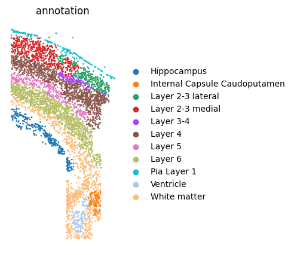
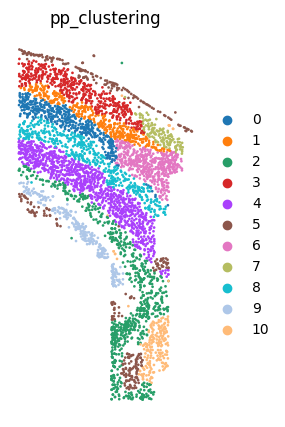
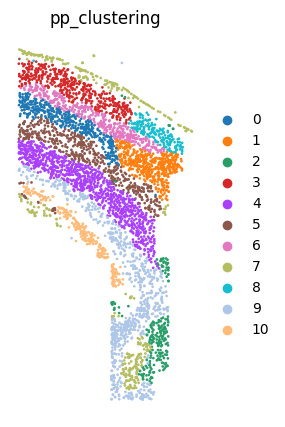

# Tutorial 4: Application on osmFISH Somatosensory Cortex dataset. 
In this vignette, We performed `PROST` on the processed Somatosensory Cortex dataset from [(Codeluppi, S. et al. 2018)](https://doi.org/10.1038/s41592-018-0175-z) generated by [osmFISH](dx.doi.org/10.17504/protocols.io.psednbe) to evaluate the robustness of PROST about data dropoff.  
The original data can be downloaded from [google drive](). 

---

### 1.Load PROST and its dependent packages

    import numpy as np
    import scanpy as sc
    import os
    import pandas as pd
    import warnings
    warnings.filterwarnings("ignore")
    import matplotlib.pyplot as plt
    import sys
    from sklearn import metrics
    import PROST
    PROST.__version__

    >>> ' 1.1.2 '

### 2.Set up the working environment and import data 

    # the location of R (used for the mclust clustering)
    ENVpath = "your path of PROST_ENV"            # refer to 'How to use PROST' section  
    os.environ['R_HOME'] = f'{ENVpath}/lib/R'
    os.environ['R_USER'] = f'{ENVpath}/lib/python3.7/site-packages/rpy2'
    
    # init
    SEED = 818
    PROST.setup_seed(SEED)
    
    # Set directory (If you want to use additional data, please change the file path)
    rootdir = 'datasets/osmFISH/'

    input_dir = os.path.join(rootdir)
    output_dir = os.path.join(rootdir, 'results/')
    if not os.path.isdir(output_dir):
        os.makedirs(output_dir)

    # Read data
    adata = sc.read_loom(input_dir+'osmFISH_SScortex_mouse_all_cells.loom')
    adata.obsm['spatial'] = adata.obs[['X','Y']].values

    # Excluding cells
    used_cells = adata.obs.Region!='Excluded'
    adata = adata[used_cells,]

### 3.Plot annotation and save data 

    # Plot annotation
    plt.rcParams["figure.figsize"] = (5,5)
    sc.pl.embedding(adata, basis="spatial", color="Region",size = 15, show=False, title='annotation')
    plt.axis('off')
    plt.gca().set_aspect('equal', 'box')
    plt.savefig(output_dir+"annotation.png", dpi=600, bbox_inches='tight')

    # Save data
    adata.write_h5ad(output_dir+"/used_data.h5")

    >>> Trying to set attribute `.obs` of view, copying.
    >>> ... storing 'ClusterName' as categorical
    >>> Trying to set attribute `.obs` of view, copying.
    >>> ... storing 'Region' as categorical
    >>> Trying to set attribute `.var` of view, copying.
    >>> ... storing 'Fluorophore' as categorical
      

--- 

## Clustering on original data

    # Set the number of clusters
    n_clusters = 11     # same as annotation

    # Dropout simulation
    adata = sc.read(output_dir+"/used_data.h5")

    dropout = 0.05 # drop out rate=0.05
    adata = PROST.simulateH5Data(adata, rr = dropout)
    adata.write_h5ad(output_dir + f"/used_data_drop={dropout}.h5")

    >>> dropout rate = 0.05
    >>> Done! Remain 105115/110647

### 1.Expression data preprocessing

    PROST.setup_seed(SEED)
    # Read data
    adata = sc.read(output_dir+"/used_data.h5")

    sc.pp.normalize_total(adata)
    sc.pp.log1p(adata)

### 2.Run PROST clustering
    PROST.run_prost_clust(adata, 
                        platform="osmFISH", 
                        min_distance = 800,
                        init="mclust",
                        n_clusters = n_clusters,                      
                        tol = 5e-3,
                        laplacin_filter = True,
                        SEED=SEED,
                        lr = 0.1,
                        max_epochs = 100)

    >>> Calculating adjacency matrix ...
    >>> Running PCA ...
    >>> Laplacian Smoothing ...
    >>> Initializing cluster centers with mclust, n_clusters known
    >>> Epoch: : 102it [02:34,  1.52s/it, loss=0.18372384]         
    >>> Clustering completed !!

### 3.Post-process cluster result

    adata = PROST.cluster_post_process(adata, 
                                   platform='osmFISH', 
                                   min_distance = 1000, 
                                   key_added = "pp_clustering", 
                                   run_times = 3)

    >>> Post-processing for clustering result ...
    >>> Refining clusters, run times: 1/3
    >>> Refining clusters, run times: 2/3
    >>> Refining clusters, run times: 3/3

### 4.Calcluate ARI

    ARI = metrics.adjusted_rand_score(adata.obs["Region"], adata.obs["pp_clustering"])
    print("pp_clustering_ARI =", ARI)

    >>> pp_clustering_ARI= 0.6766793390568708

### 5.Save clustering result

    pp_clustering = adata.obs["pp_clustering"] 
    embedding = adata.obsm["PROST"]

    adata.write_h5ad(output_dir + f"/PNN_result.h5")
    pp_clustering.to_csv(output_dir + f"/pp_clusters.csv",header = False)
    np.savetxt(output_dir + f"/embedding.txt",embedding)

### 6.Plot clustering result

    adata=sc.read(output_dir + f"/PNN_result.h5")

    #
    plt.rcParams["figure.figsize"] = (5,5)
    sc.pl.embedding(adata, basis="spatial", color="pp_clustering", size     = 15, show=False, title='pp_clustering')
    plt.axis('off')
    plt.gca().set_aspect('equal', 'box')
    plt.savefig(output_dir + f"/pp_clustering.png", dpi=600,    bbox_inches='tight')

--- 

## Clustering on simulated data (drop out rate=0.05)

    # Set the number of clusters
    n_clusters = 11     # same as annotation

    dropout = 0.05 # drop out rate=0.05
    adata = PROST.simulateH5Data(adata, rr = dropout)
    adata.write_h5ad(output_dir + f"/used_data_drop={dropout}.h5")

    >>> dropout rate = 0.05
    >>> Done! Remain 105115/110647
    

### 1.Expression data preprocessing

    PROST.setup_seed(SEED)
    # Read data
    adata = sc.read(output_dir+"/used_data.h5")

    sc.pp.normalize_total(adata)
    sc.pp.log1p(adata)

### 2.Run PROST clustering

    PROST.run_prost_clust(adata, 
                        platform="osmFISH", 
                        min_distance = 700,
                        init="mclust",
                        n_clusters = 11,
                        tol = 5e-3,
                        laplacin_filter = True,
                        SEED=SEED,
                        lr = 0.1,
                        max_epochs = 100)

    >>> Calculating adjacency matrix ...
    >>> Running PCA ...
    >>> Laplacian Smoothing ...
    >>> Initializing cluster centers with mclust, n_clusters known
    >>> Epoch: : 102it [02:47,  1.64s/it, loss=0.19401526]             
    >>> Clustering completed !!

### 3.Post-process cluster result

    adata = PROST.cluster_post_process(adata, 
                                   platform='osmFISH', 
                                   min_distance = 1000, 
                                   key_added = "pp_clustering", 
                                   run_times = 3)

    >>> Post-processing for clustering result ...
    >>> Refining clusters, run times: 1/3
    >>> Refining clusters, run times: 2/3
    >>> Refining clusters, run times: 3/3

### 4.Calcluate ARI

    ARI = metrics.adjusted_rand_score(adata.obs["Region"], adata.obs["pp_clustering"])
    print("pp_clustering_ARI =", ARI)

    >>> pp_clustering_ARI = 0.6799485227477202

### 5.Save clustering result

    pp_clustering = adata.obs["pp_clustering"] 
    embedding = adata.obsm["PROST"]

    if not os.path.isdir(output_dir + f"/dropout={dropout}/"):
        os.makedirs(output_dir + f"/dropout={dropout}/")

    pp_clustering.to_csv(output_dir + f"/dropout={dropout}/pp_clusters.csv", header = False)
    adata.write_h5ad(output_dir + f"/dropout={dropout}/PNN_result.h5")
    np.savetxt(output_dir + f"/dropout={dropout}/embedding.txt",embedding)

### 6.Plot clustering result

    adata=sc.read(output_dir + f"/dropout={dropout}/PNN_result.h5")
    plt.rcParams["figure.figsize"] = (5,5)
    sc.pl.embedding(adata, basis="spatial", color="pp_clustering", size = 15, show=False, title='pp_clustering')
    plt.axis('off')
    plt.gca().set_aspect('equal', 'box')
    plt.savefig(output_dir+f"/dropout={dropout}/pp_clustering.png", dpi=600, bbox_inches='tight')

