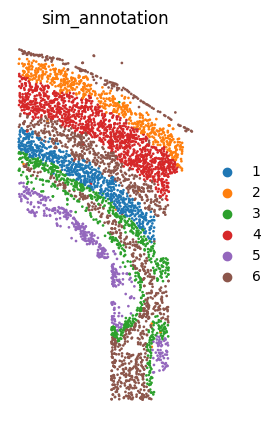
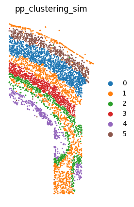

# Tutorial 5: Application on simulated osmFISH Somatosensory Cortex dataset. 
In this vignette, We performed `PROST` on the simulated Somatosensory Cortex dataset from [(Andrew Cheng. et al. 2023)](https://doi.org/10.1093/bib/bbac475) to evaluate the robustness of PROST about simulated data.  
The [original data](https://github.com/acheng416/Benchmark-CTCM-ST) can be downloaded from [google drive](https://drive.google.com/drive/folders/1Rt5YS_i-qLbXmSHMnnFjXfhiilR0tOv4?usp=drive_link). 

---

### 1.Load PROST and its dependent packages

    import numpy as np
    import scanpy as sc
    import os
    import pandas as pd
    import warnings
    warnings.filterwarnings("ignore")
    import matplotlib.pyplot as plt
    import sys
    from sklearn import metrics
    import PROST
    PROST.__version__

    >>> ' 1.1.2 '

### 2.Set up the working environment and import data 

    # the location of R (used for the mclust clustering)
    ENVpath = "your path of PROST_ENV"            # refer to 'How to use PROST' section  
    os.environ['R_HOME'] = f'{ENVpath}/lib/R'
    os.environ['R_USER'] = f'{ENVpath}/lib/python3.7/site-packages/rpy2'
    
    # init
    SEED = 818
    PROST.setup_seed(SEED)
    
    # Set directory (If you want to use additional data, please change the file path)
    rootdir = 'datasets/osmFISH/'

    input_dir = os.path.join(rootdir)
    output_dir = os.path.join(rootdir, 'results/')
    if not os.path.isdir(output_dir):
        os.makedirs(output_dir)

    # Read data
    adata = sc.read_loom(input_dir+'osmFISH_SScortex_mouse_all_cells.loom')
    
    # Read used cells from oringal data
    used_cells = adata.obs.Region != 'Excluded'
    used_cells = pd.DataFrame(used_cells).reset_index()
    used_cell_ID = used_cells[used_cells['Region']]['CellID']
    used_cell_ID = list(used_cell_ID)

    # Filter oringal data
    adata = adata[adata.obs.Region!='Excluded',]

    # Read simulated data
    simcount = pd.read_csv(input_dir + "/Dataset5_counts1.txt",delim_whitespace=True)
    simcount.columns = [str(x)[5:] for x in simcount.columns]
    sim_adata = sc.AnnData(simcount.T)

    # Read simulated annotation
    sim_annotation = pd.read_csv(input_dir + "/Dataset5_true_cl1.csv",index_col=0)
    sim_adata.obs['annotation'] = sim_annotation.values
    sim_adata.obs['annotation'] = sim_adata.obs['annotation'].astype('category')

    # Filter simulated data
    for i in sim_adata.obs_names:
        if i in used_cell_ID:
            sim_adata.obs.loc[i,'keep'] = True
    sim_adata.obs['keep'] = sim_adata.obs['keep'].fillna(False)
    sim_adata = sim_adata[sim_adata.obs.keep,:]

    # Read location information from oringal data
    sim_adata.obsm['spatial'] = adata.obs[['X','Y']].values

    # Save simulated adata
    sim_adata.write_h5ad(output_dir + "sim_adata.h5")

### 3.Plot annotation

    # Plot simulated annotation
    adata = sc.read(output_dir + "sim_adata.h5")
    plt.rcParams["figure.figsize"] = (5,5)
    sc.pl.embedding(adata, basis="spatial", color="annotation", size = 15,  show=False, title='sim_annotation')
    plt.axis('off')
    plt.gca().set_aspect('equal', 'box')
    plt.savefig(output_dir+"sim_annotation.png", dpi=600, bbox_inches='tight')

      

--- 

## Clustering on original data

    # Set the number of clusters
    n_clusters = 6     # same as annotation

### 1.Expression data preprocessing

    PROST.setup_seed(SEED)
    adata = sc.read(output_dir + "sim_adata.h5")

    sc.pp.normalize_total(adata)
    sc.pp.log1p(adata)

### 2.Run PROST clustering
    
    PROST.run_PNN(adata, 
            platform="osmFISH", 
            min_distance = 275,
            init="mclust",
            n_clusters = n_clusters,
            tol = 5e-3,
            SEED=SEED,
            max_epochs = 100,
            post_processing = True,
            pp_run_times = 1)

    >>> Calculating adjacency matrix ...
    >>> Running PCA ...
    >>> Laplacian Smoothing ...
    >>> Initializing cluster centers with mclust, n_clusters known
    >>> Epoch: : 102it [02:36,  1.54s/it, loss=0.14192994]  
    >>> Clustering completed !!
    >>> Post-processing for clustering result ...
    >>> Refining clusters, run times: 1/1

### 3.Calcluate ARI

    ARI = metrics.adjusted_rand_score(adata.obs["annotation"], adata.obs["pp_clustering"])
    print("clustering_ARI=", ARI)

    >>> clustering_ARI= 0.9041096401232858

### 4.Save clustering result

    pp_clustering = adata.obs["pp_clustering"] 
    embedding = adata.obsm["PROST"]

    pp_clustering.to_csv(output_dir + "pp_clustering_sim.csv",header = False)
    adata.write_h5ad(output_dir + "PNN_result_sim.h5")
    np.savetxt(output_dir + "embedding_sim.txt",embedding)

### 5.Plot clustering result

    adata = sc.read(output_dir + "PNN_result_sim.h5")

    #
    plt.rcParams["figure.figsize"] = (5,5)
    sc.pl.embedding(adata, basis="spatial", color="pp_clustering", size = 15, show=False, title='pp_clustering_sim')
    plt.axis('off')
    plt.gca().set_aspect('equal', 'box')
    plt.savefig(output_dir+"pp_clustering_sim.png", dpi=600, bbox_inches='tight')

--- 
