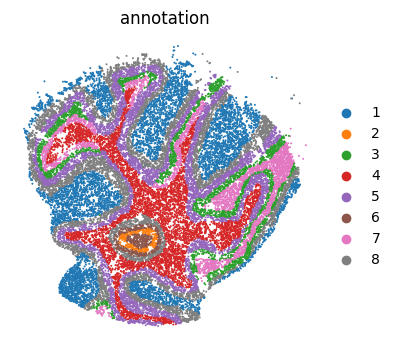
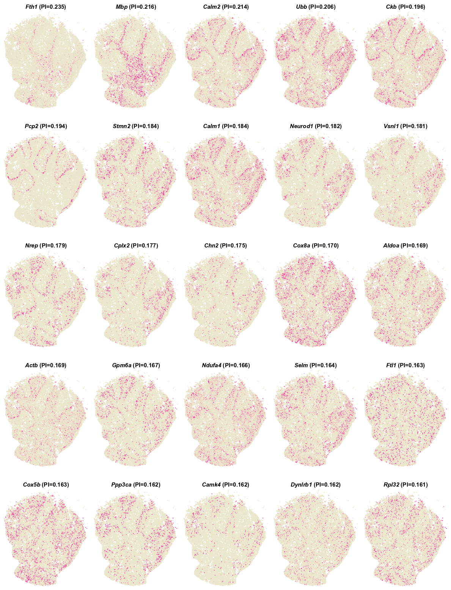
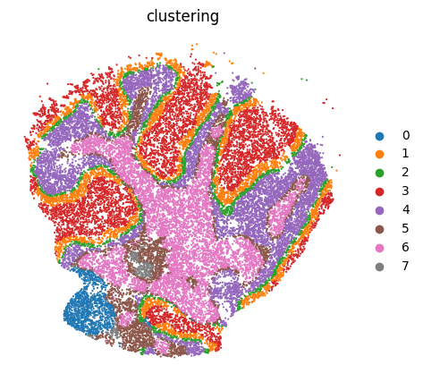

# Tutorial 6: Application on Slide-seq mouse Cerebellum dataset. 
In this vignette, We performed `PROST` on the processed mouse cerebellum dataset from [(Samuel G. et al. 2019)](https://10.1126/science.aaw1219) to evaluate the computational efficiency.  
The [original data](https://singlecell.broadinstitute.org/single_cell/study/SCP795/) can be downloaded from [google drive](https://drive.google.com/drive/folders/1chkWzG0Y4YkO6ys-LLntXfXC3WDTk8Pm?usp=drive_link). 

---

### 1.Load PROST and its dependent packages

    import numpy as np
    import scanpy as sc
    import os
    import pandas as pd
    import warnings
    warnings.filterwarnings("ignore")
    import matplotlib.pyplot as plt
    import sys
    from sklearn import metrics
    import PROST
    PROST.__version__

    >>> ' 1.1.2 '

### 2.Set up the working environment and import data 

    # the location of R (used for the mclust clustering)
    ENVpath = "your path of PROST_ENV"            # refer to 'How to use PROST' section  
    os.environ['R_HOME'] = f'{ENVpath}/lib/R'
    os.environ['R_USER'] = f'{ENVpath}/lib/python3.7/site-packages/rpy2'
    
    # init
    SEED = 818
    PROST.setup_seed(SEED)
    
    # Set directory (If you want to use additional data, please change the file path)
    rootdir = 'datasets/Slide-seq/'

    input_dir = os.path.join(rootdir)
    output_dir = os.path.join(rootdir, 'results/')
    if not os.path.isdir(output_dir):
        os.makedirs(output_dir)

    # Read data
    adata = sc.read(input_dir+"used_data.h5")

### 3.Plot annotation

    # Plot annotation
    plt.rcParams["figure.figsize"] = (4,4)
    sc.pl.embedding(adata, basis="spatial", color="annotation",size = 8, show=False, title='annotation')
    plt.axis('off')
    plt.savefig(output_dir+"annotation.png", dpi=600, bbox_inches='tight')

### 4.Calculate PI
    
    # Calculate PI
    adata = PROST.prepare_for_PI(adata, percentage = 0.01, platform="Slide-seq")
    adata = PROST.cal_PI(adata, platform="Slide-seq")

    # Save PI
    adata.write_h5ad(output_dir+"/PI_result.h5")

    # Draw SVGs detected by PI
    PROST.plot_gene(adata, platform="Slide-seq", sorted_by='PI', size = 0.3, top_n = 25, ncols_each_sheet = 5, nrows_each_sheet = 5,save_path = output_dir)
      
    
    >>> Filtering genes ...
    >>> Trying to set attribute `.var` of view, copying.
    >>> Normalization to each gene:
    >>> 100%|██████████████████████| 2193/2193 [00:00<00:00, 3513.47it/s]
    >>> Gaussian filtering for each gene:
    >>> 100%|██████████████████████| 2193/2193 [06:08<00:00,  5.96it/s]
    >>> Binary segmentation for each gene:
    >>> 100%|██████████████████████| 2193/2193 [00:07<00:00, 305.77it/s]
    >>> Spliting subregions for each gene:
    >>> 100%|██████████████████████| 2193/2193 [00:24<00:00, 88.86it/s]
    >>> Computing PROST Index for each gene:
    >>> 100%|██████████████████████| 2193/2193 [06:15<00:00,  5.83it/s]
    >>> PROST Index calculation completed !!
    >>> Drawing pictures:
    >>> 100%|██████████████████████| 1/1 [00:19<00:00, 19.73s/it]
    >>> Drawing completed !!

--- 

## Clustering on original data

    # Set the number of clusters
    n_clusters = 8     # same as annotation

### 1.Expression data preprocessing

    PROST.setup_seed(SEED)
    # Read data
    adata = sc.read(input_dir+"/used_data.h5")

    sc.pp.normalize_total(adata)
    sc.pp.log1p(adata)

### 2.Run PROST clustering
    PROST.run_PNN(adata, 
            platform="slide-seq", 
            min_distance = 80,
            init="mclust",
            n_clusters = n_clusters,                   
            tol = 5e-3,
            SEED=SEED,
            max_epochs = 25)

    >>> Calculating adjacency matrix ...
    >>> Running PCA ...
    >>> Laplacian Smoothing ...
    >>> Initializing cluster centers with mclust, n_clusters known
    >>> Epoch: : 27it [19:21, 43.02s/it, loss=0.1746949]             
    >>> Clustering completed !!

### 3.Calcluate ARI

    ARI = metrics.adjusted_rand_score(adata.obs["annotation"], adata.obs["clustering"])
    print("pp_clustering_ARI =", ARI)

    >>> pp_clustering_ARI = 0.3332276319944897

### 5.Save clustering result

    adata.obs["clustering"].to_csv(output_dir + "/clustering.csv", header = False)
    np.savetxt(output_dir + "/embedding.txt", adata.obsm["PROST"])
    adata.write_h5ad(output_dir + "/PNN_result.h5")

### 6.Plot clustering result

    adata = sc.read(output_dir + "/PNN_result.h5")
    plt.rcParams["figure.figsize"] = (5,5)
    sc.pl.embedding(adata, basis="spatial", color="clustering", size = 10,  show=False, title='clustering')
    plt.axis('off')
    plt.savefig(output_dir+"/clustering.png", dpi=600, bbox_inches='tight')

--- 
