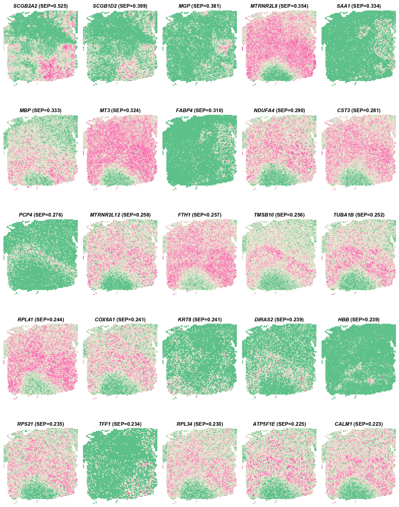
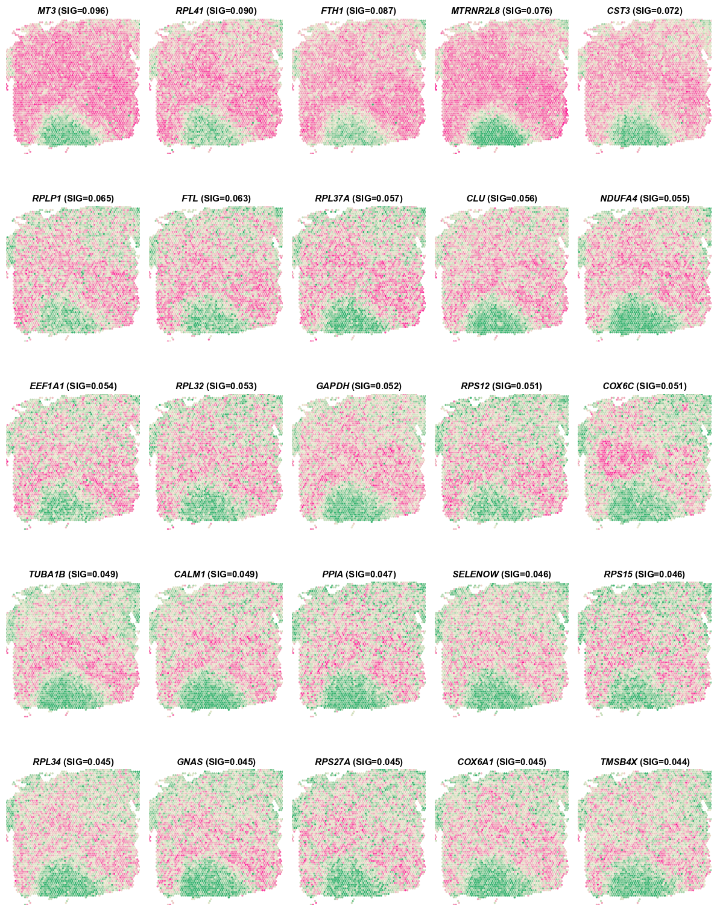
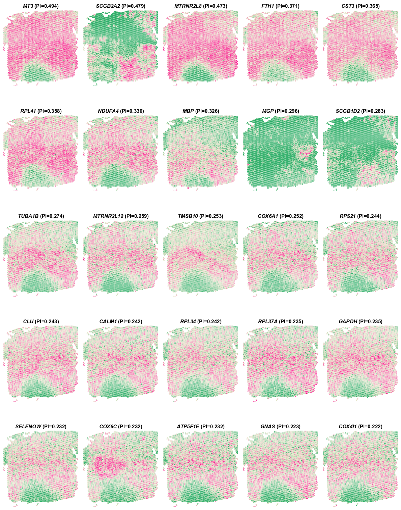

# Tutorial 7: Tutorial of PROST index.
In this tutorial, we provide a detailed introduction of PI on the human dorsolateral prefrontal cortex (DLPFC) 10x Visium ST dataset from [(Pardo B. et al. 2022)](https://doi.org/10.1186/s12864-022-08601-w), which was manually annotated as the cortical layers and white matter (WM).  
The original data and manual annotation are prepared and aviliable at [google drive](https://drive.google.com/drive/folders/1a_barvf0oUXDqyivWUUmv5bu9KxUlYoo).

---
### 1.Load PROST and its dependent packages

    import scanpy as sc
    import os
    import warnings
    warnings.filterwarnings("ignore")
    import sys
    import PROST
    PROST.__version__

    >>> ' 1.1.2 '

### 2.Set up the working environment and import data 

    # the location of R (used for the mclust clustering)
    ENVpath = "your path of PROST_ENV"            # refer to 'How to use PROST' section
    os.environ['R_HOME'] = f'{ENVpath}/lib/R'
    os.environ['R_USER'] = f'{ENVpath}/lib/python3.7/site-packages/rpy2'
    
    # Set seed
    SEED = 818
    PROST.setup_seed(SEED)
    
    #%% Read in data
    section_num = 151672
    
    # Set directory (If you want to use additional data, please     change the file path)
    rootdir = 'datasets/DLPFC'
    
    input_dir = os.path.join(f'{rootdir}', str(section_num))
    spatial_dir = os.path.join(f'{rootdir}', str(section_num),  'spatial')
    output_dir = os.path.join(f'{rootdir}', str(section_num),   'results')
    if not os.path.isdir(output_dir):
        os.makedirs(output_dir)
    
    # Read data from input_dir
    adata = sc.read_visium(path=input_dir, count_file='{}_filtered_feature_bc_matrix.h5'.format(section_num))
    adata.var_names_make_unique()

    >>> Variable names are not unique. To make them unique, call `.var_names_make_unique`.
    >>> Variable names are not unique. To make them unique, call `.var_names_make_unique`.

### 3.Calculate and save PI

    # Calculate PI
    adata = PROST.prepare_for_PI(adata, platform="visium")
    adata = PROST.cal_PI(adata, platform="visium")

    # Spatial autocorrelation test
    PROST.spatial_autocorrelation(adata)

    # Save PI result
    adata.write_h5ad(output_dir+"/PI_result.h5")

    >>> Filtering genes ...
    >>> Calculating image index 1D:
    >>> 100%|██████████| 4015/4015 [00:00<00:00, 70423.08it/s]
    >>> Trying to set attribute `.var` of view, copying.
    >>> Normalization to each gene:
    >>> 100%|██████████| 5083/5083 [00:00<00:00, 13624.30it/s]
    >>> Gaussian filtering for each gene:
    >>> 100%|██████████| 5083/5083 [01:07<00:00, 74.99it/s]
    >>> Binary segmentation for each gene:
    >>> 100%|██████████| 5083/5083 [03:44<00:00, 22.60it/s]
    >>> Spliting subregions for each gene:
    >>> 100%|██████████| 5083/5083 [01:14<00:00, 68.52it/s]
    >>> Computing PROST Index for each gene:
    >>> 100%|██████████| 5083/5083 [00:03<00:00, 1478.57it/s]
    >>> PROST Index calculation completed !!
    

### 4.Pre-process
    
    # Read PI result
    adata = sc.read(output_dir+"/PI_result.h5")

    # Remove MT-gene
    drop_gene_name = "MT-"
    selected_gene_name = list(adata.var_names[adata.var_names.str.contains("MT-") == False])
    adata = PROST.feature_selection(adata, selected_gene_name=selected_gene_name)
    adata

    >>> View of AnnData object with n_obs × n_vars = 4015 × 5070
    >>> obs: 'in_tissue', 'array_row', 'array_col', 'image_idx_1d'
    >>> var: 'gene_ids', 'feature_types', 'genome', 'n_cells', 'SEP', 'SIG', 'PI', 'Moran_I', 'Geary_C', 'p_norm', 'p_rand', 'fdr_norm', 'fdr_rand', 'selected'
    >>> uns: 'binary_image', 'del_index', 'gau_fea', 'locates', 'nor_counts', 'spatial', 'subregions'
    >>> obsm: 'spatial'

### 5.Sort PI in descending order

    PI_result = adata.var[['SEP','SIG','PI','fdr_rand']]
    PI_sort = PI_result.sort_values(by="PI", ascending=False)

    # Plot genes in descending order of Separability
    PROST.plot_gene(adata, platform="visium", sorted_by="SEP", top_n=25, size=2)

    >>> Drawing pictures:
    >>> 100%|██████████████| 1/1 [00:00<00:00,  1.15it/s]
    >>> Drawing completed !!

    # Plot genes in descending order of Significance
    PROST.plot_gene(adata, platform="visium", sorted_by="SIG", top_n=25, size=2)
    
    >>> Drawing pictures:
    >>> 100%|██████████████| 1/1 [00:00<00:00,  1.15it/s]
    >>> Drawing completed !!

    # Plot genes in descending order of PI
    PROST.plot_gene(adata, platform="visium", sorted_by="PI", top_n=25, size=2)
    
    >>> Drawing pictures:
    >>> 100%|██████████████| 1/1 [00:00<00:00,  1.15it/s]
    >>> Drawing completed !!

---
