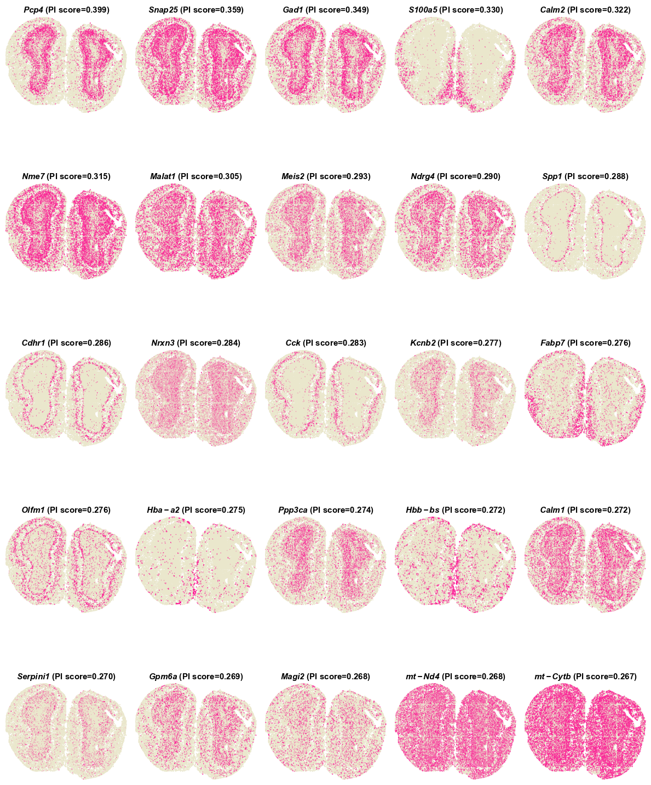
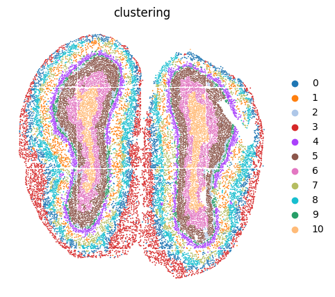
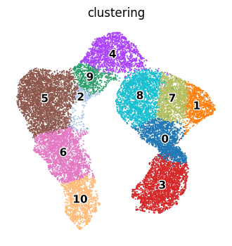

# Tutorial 1: Application on 10x Visium human dorsolateral prefrontal cortex (DLPFC) dataset.
In this vignette, we analyzed the human dorsolateral prefrontal cortex (DLPFC) 10x Visium ST dataset from [(Pardo B. et al. 2022)](https://doi.org/10.1186/s12864-022-08601-w), which was manually annotated as the cortical layers and white matter (WM).  
The original data and manual annotation are prepared and aviliable at [google drive](https://drive.google.com/drive/folders/1a_barvf0oUXDqyivWUUmv5bu9KxUlYoo).

---
## Identify SVGs
### 1.Load PROST and its dependent packages

    import pandas as pd 
    import numpy as np 
    import scanpy as sc 
    import os 
    import warnings 
    warnings.filterwarnings("ignore") 
    import matplotlib as mpl 
    import matplotlib.pyplot as plt 
    import PROST 
    PROST.__version__ 

    >>> ' 1.1.2 '

### 2.Set up the working environment and import data 

    # the location of R (used for the mclust clustering)
    ENVpath = r"C:\Users\PC\miniconda3\envs\PROST_ENV"            # refer to 'How to use    PROST' section
    os.environ['R_HOME'] = f'{ENVpath}/lib/R'
    os.environ['R_USER'] = f'{ENVpath}/lib/python3.7/site-packages/rpy2'
    
    # Set seed
    SEED = 818
    PROST.setup_seed(SEED)
    
    #%% Read in data
    section_num = 151672
    
    # Set directory (If you want to use additional data, please     change the file path)
    rootdir = 'datasets/DLPFC'
    
    input_dir = os.path.join(f'{rootdir}', str(section_num))
    spatial_dir = os.path.join(f'{rootdir}', str(section_num),  'spatial')
    output_dir = os.path.join(f'{rootdir}', str(section_num),   'results')
    if not os.path.isdir(output_dir):
        os.makedirs(output_dir)
    
    # Read data from input_dir
    adata = sc.read_visium(path=input_dir, count_file='{}_filtered_feature_bc_matrix.h5'.format(section_num))
    adata.var_names_make_unique()

    >>> Variable names are not unique. To make them unique, call `.var_names_make_unique`.
    >>> Variable names are not unique. To make them unique, call `.var_names_make_unique`.

### 3.Calculate and save PI

    # Calculate PI
    adata = PROST.prepare_for_PI(adata, platform="visium") 
    adata = PROST.cal_prost_index(adata, platform="visium")

    # Calculate spatial autocorrelation statistics and do hypothesis test
    '''
    PROST.spatial_autocorrelation(adata, k = 10, permutations = None)
    '''

    # Save PI result
    adata.write_h5ad(output_dir+"/PI_result.h5")

    >>> Filtering genes ...

    >>> Calculating image index 1D:
    >>> 100%|██████████| 4015/4015 [00:00<00:00, 70423.08it/s]
    >>> Trying to set attribute `.var` of view, copying.
    >>> Normalization to each gene:
    >>> 100%|██████████| 5083/5083 [00:00<00:00, 13624.30it/s]
    >>> Gaussian filtering for each gene:
    >>> 100%|██████████| 5083/5083 [01:07<00:00, 74.99it/s]
    >>> Binary segmentation for each gene:
    >>> 100%|██████████| 5083/5083 [03:44<00:00, 22.60it/s]
    >>> Spliting subregions for each gene:
    >>> 100%|██████████| 5083/5083 [01:14<00:00, 68.52it/s]
    >>> Computing PROST Index for each gene:
    >>> 100%|██████████| 5083/5083 [00:03<00:00, 1478.57it/s]
    >>> PROST Index calculation completed !!
    

### 4.Draw SVGs detected by PI
    # Draw SVGs detected by PI
    PROST.plot_gene(adata, platform="visium",size = 2, sorted_by = "PI", top_n = 25,save_path = output_dir)

    ... storing 'feature_types' as categorical
    ... storing 'genome' as categorical

    Drawing pictures:
    100%|██████████| 1/1 [00:09<00:00,  9.55s/it]

    Drawing completed !!

---
## Clustering 
    # Set the number of clusters
    n_clusters = 5
    

### 1.Read PI result and Expression data preprocessing
    adata = sc.read(output_dir+"/PI_result.h5")

    sc.pp.normalize_total(adata)
    sc.pp.log1p(adata)
    adata = PROST.feature_selection(adata, save_path = output_dir, by = "prost", n_top_genes = 3000)

### 2.Run PROST clustering
    PROST.run_prost_clust(adata,
                        platform="visium",
                        key_added = "PROST",
                        init="mclust",                         
                        n_clusters = n_clusters,                        
                        gnnlayers = 2,              
                        laplacin_filter = True,                        
                        lr = 0.1,                         
                        SEED=SEED,                          
                        max_epochs = 500,                        
                        tol = 5e-3,                        
                        post_processing = True,                        
                        pp_run_times = 3,
                        cuda = False)

    >>> Calculating adjacency matrix ...
    >>> Running PCA ...
    >>> Laplacian Smoothing ...
    >>> Initializing cluster centers with mclust, n_clusters known
    >>> Epoch: : 501it [09:07,  1.09s/it, loss=0.093866244]                       
    >>> Clustering completed !!
    >>> Post-processing for clustering result ...
    >>> Refining clusters, run times: 1/3
    >>> Refining clusters, run times: 2/3
    >>> Refining clusters, run times: 3/3

### 4.Plot clustering results 

    # Read data
    adata = sc.read(output_dir+'/PNN_result.h5')

    # Read annotation
    labels_true = pd.read_csv(input_dir+'/cluster_labels.csv')
    labels_true.index = labels_true["key"].str[7:]
    adata.obs["annotation"] = labels_true["ground_truth"]
    adata.obs["annotation"] = adata.obs["annotation"].astype('category').astype('str')

    # Set colors
    plot_color = ['#1f77b4','#ff7f0e','#2ca02c','#d62728','#9467bd','#8c564b','#e377c2']
    cmp = mpl.colors.ListedColormap(plot_color)

    # Plot clustering results
    plt.rcParams["figure.figsize"] = (4,4)
    sc.pl.spatial(adata, 
                    img_key = "hires", 
                    color = ["annotation","clustering","pp_clustering"],
                    title = ["Manual annotation",'clustering','post-processed clustering'],                
                    na_in_legend = False,
                    ncols = 3,
                    size = 1)

    
    >>> storing 'annotation' as categorical

### 5.Calculate ARI and NMI 
To compare the domain segmentation performance quantitatively, we used the Adjusted Rand Index (ARI) and Normalized Mutual Information (NMI) to measure the similarity between the predicted domains and the manual annotations across all twelve sections of the DLPFC dataset.

    ARI, NMI, silhouette_score = PROST.cal_metrics_for_DLPFC(adata.obs["pp_clustering"], labels_true_path = input_dir+'/cluster_labels.csv')

    
    >>> ARI = 0.5910397042708356 
    >>> AMI = 0.6813238415316797 
    >>> NMI = 0.6818348825641031 
    >>> v_measure_score = 0.6818348825641031 
    >>> silhouette_score = 0.3681630775671734 
    ==================================================

### 6.Plot UMAP and PAGA graph 
Next, the embeddings generated by PROST was applied to UMAP for visualization and PAGA for inferring trajectory.

    adata = sc.read_visium(path=input_dir, count_file='{}   _filtered_feature_bc_matrix.h5'.format(section_num))
    adata.var_names_make_unique()

    # Read annotation
    labels_true = pd.read_csv(input_dir+'/cluster_labels.csv')
    labels_true.index = labels_true["key"].str[7:]
    adata.obs["annotation"] = labels_true["ground_truth"]
    adata.obs["annotation"] = adata.obs["annotation"].astype('category').   astype('str')
    used_adata = adata[adata.obs["annotation"]!='nan']
    prost_embed = pd.read_csv(output_dir+"/embedding.txt",header = None,    delim_whitespace=True)
    prost_embed.index = labels_true.index
    adata.obsm["PROST"] = prost_embed
    
    # Plot
    plt.rcParams["figure.figsize"] = (6,5)
    sc.pp.neighbors(used_adata, use_rep="PROST")
    sc.tl.umap(used_adata)
    sc.tl.paga(used_adata,groups='annotation')
    sc.pl.paga_compare(used_adata, color="annotation",random_state=1,
                                 size = 35,legend_fontsize=25,  node_size_scale=4,
                                 frameon=False, show = False,fontoutline = 2)

    >>> Variable names are not unique. To make them unique, call `.var_names_make_unique`.
    >>> Variable names are not unique. To make them unique, call `.var_names_make_unique`.
    >>> ... storing 'annotation' as categorical
    >>> ... storing 'feature_types' as categorical
    >>> ... storing 'genome' as categorical
    >>> [<Axes:xlabel='UMAP1', ylabel='UMAP2'>, <Axes:>]

  

---

# Tutorial 2: Application on Stereo-seq mouse olfactory bulb dataset.
In this vignette, we analysis the [Stereo-seq](https://doi.org/10.1016/j.cell.2022.04.003) mouse olfactory bulb dataset (~14 μm in diameter per spot) from [(Huazhu Fu. et al. 2021)](https://doi.org/10.1101/2021.06.15.448542) to evaluate the performance of PROST on ST datasets with single-cell resolution.  
We followed [(Kangning Dong. et al. 2022)](https://doi.org/10.1038/s41467-022-29439-6) to remove the spots outside the tissue section. The processed data can be downloaded from [google drive](https://drive.google.com/drive/folders/1lcGdArvtBcXkA0vE-v2GyQgeBrlZUpto?usp=share_link).  

## Identify SVGs
### 1.Load PROST and its dependent packages

    import pandas as pd
    import numpy as np
    import scanpy as sc
    import os
    import warnings
    warnings.filterwarnings("ignore")
    import matplotlib.pyplot as plt
    import matplotlib as mpl
    import sys
    import PROST
    PROST.__version__

    >>> ' 1.1.2 '

### 2.Set up the working environment and import data 

    # the location of R (used for the mclust clustering)
    ENVpath = "your path of PROST_ENV"            # refer to 'How to use PROST' section 
    os.environ['R_HOME'] = f'{ENVpath}/lib/R'
    os.environ['R_USER'] = f'{ENVpath}/lib/python3.7/site-packages/rpy2'
    
    # init
    SEED = 818
    PROST.setup_seed(SEED)
    
    # Set directory (If you want to use additional data, please change the file path)
    rootdir = 'datasets/Stereo-seq/'
    
    input_dir = os.path.join(rootdir)
    output_dir = os.path.join(rootdir, 'results/')
    if not os.path.isdir(output_dir):
        os.makedirs(output_dir)

    # Read data from input_dir
    adata=sc.read(input_dir+"/used_data.h5")

### 3.Calculate and save PI

    adata = PROST.prepare_for_PI(adata, percentage = 0.01, platform="stereo-seq")
    adata = PROST.cal_prost_index(adata, connect_kernel_size=6, neighbors=8,    platform="stereo-seq")
    # Calculate spatial autocorrelation statistics and Hypothesis test
    '''
    PROST.spatial_autocorrelation(adata, k = 10, permutations = None)
    '''

    adata.write_h5ad(output_dir+"/PI_result.h5")

    >>> Filtering genes ...
    >>> Trying to set attribute `.var` of view, copying.
    >>> Normalization to each gene:
    >>> 100%|██████████| 8520/8520 [00:02<00:00, 2871.91it/s]
    >>> Gaussian filtering for each gene:
    >>> 100%|██████████| 8520/8520 [18:07<00:00,  7.83it/s]
    >>> Binary segmentation for each gene:
    >>> 100%|██████████| 8520/8520 [00:29<00:00, 285.26it/s]
    >>> Spliting subregions for each gene:
    >>> 100%|██████████| 8520/8520 [01:39<00:00, 85.66it/s]
    >>> Computing PROST Index for each gene:
    >>> 100%|██████████| 8520/8520 [18:21<00:00,  7.74it/s]
    >>> PROST Index calculation completed !!
    

### 4.Draw SVGs detected by PI
    PROST.plot_gene(adata, platform="stereo-seq", size = 0.3, top_n = 25, ncols_each_sheet = 5, nrows_each_sheet = 5,save_path = output_dir)    

    >>> Drawing pictures:
    >>> 100%|██████████| 1/1 [00:15<00:00, 15.58s/it]
    >>> Drawing completed !!

--- 
## Clustering 
    # Set the number of clusters
    n_clusters = 11

### 1.Read PI result and Expression data preprocessing
    PROST.setup_seed(SEED)
    adata = sc.read(output_dir+"/PI_result.h5")

    sc.pp.normalize_total(adata)
    sc.pp.log1p(adata)
    adata = PROST.feature_selection(adata, save_path = output_dir, by = "prost",    n_top_genes = 3000)

    adata

    >>> View of AnnData object with n_obs × n_vars = 19109 × 2527
         obs: 'n_genes_by_counts', 'log1p_n_genes_by_counts', 'total_counts', 'log1p_total_counts', 'pct_counts_in_top_50_genes',    'pct_counts_in_top_100_genes', 'pct_counts_in_top_200_genes', 'pct_counts_in_top_500_genes'
         var: 'n_cells_by_counts', 'mean_counts', 'log1p_mean_counts', 'pct_dropout_by_counts', 'total_counts', 'log1p_total_counts',    'n_cells', 'SEP', 'SIG', 'PI', 'selected'
         uns: 'binary_image', 'del_index', 'gau_fea', 'locates', 'nor_counts', 'shape', 'subregions', 'log1p'
         obsm: 'spatial'

### 2.Run PROST clustering
    PROST.run_prost_clust(adata, 
                        platform="stereo-seq", 
                        min_distance = 50,
                        init="mclust",
                        n_clusters = n_clusters,                     
                        tol = 5e-3,
                        laplacin_filter = True,
                        SEED=SEED,
                        max_epochs = 500,
                        post_processing = False,
                        cuda = False)
    

    >>> Calculating adjacency matrix ...
    >>> Running PCA ...
    >>> Laplacian Smoothing ...
    >>> Initializing cluster centers with mclust, n_clusters known
    >>> Epoch: : 501it [3:07:58, 22.51s/it, loss=0. 24661717]                         
    >>> Clustering completed !!

### 3.Save result
    adata.write_h5ad(output_dir + "/PNN_result.h5")
    clustering = adata.obs["clustering"]
    clustering.to_csv(output_dir + "/clusters.csv",header = False)

### 4.Plot clustering results 
    color_list = ['#1f77b4', '#ff7f0e', '#aec7e8', '#d62728', '#aa40fc', '#8c564b',
                  '#e377c2', '#b5bd61', '#17becf', '#279e68', '#ffbb78']
    adata.uns["clustering"+"_colors"] = color_list
    plt.rcParams["figure.figsize"] = (5,5)
    sc.pl.embedding(adata, basis="spatial", color="clustering",size = 7,s=6, show=False, title='clustering')
    plt.axis('off')
    plt.savefig(output_dir+"/clustering.png", dpi=600, bbox_inches='tight')

### 5.Plot UMAP
Next, the embeddings generated by PROST was applied to UMAP for visualization.

    plt.rcParams["figure.figsize"] = (4,4)
    sc.pp.neighbors(adata, use_rep="PROST")
    sc.tl.umap(adata)
    ax = sc.pl.umap(adata, color="clustering", frameon=False, size=8,
                            show = False,legend_loc='on data',legend_fontoutline=2,legend_fontsize=11,
                            )
    plt.axis('off')
    plt.subplots_adjust()
    plt.savefig(output_dir+"/umap.png", dpi=600,bbox_inches='tight')

 

--- 

# Tutorial 4: Application on osmFish mouse embryo dataset. 
In this vignette, We performed `PROST` on the processed mouse embryo ST data from [(Lohoff, T. et al. 2022)](https://doi.org/10.1038/s41587-021-01006-2) generated by [SeqFISH](https://spatial.caltech.edu/seqfish/) to evaluate its general applicability.  
The original data can be downloaded from [google drive](https://drive.google.com/drive/folders/1r5Cuo4YqZVtFPpB-VqDoHkMW6vhl9glf?usp=share_link). 

---

## Identify SVGs
### 1.Load PROST and its dependent packages

    import pandas as pd 
    import numpy as np 
    import scanpy as sc 
    import os 
    import warnings 
    warnings.filterwarnings("ignore") 
    import matplotlib as mpl 
    import matplotlib.pyplot as plt 
    import PROST 
    PROST.__version__ 

    >>> ' 1.1.2 '

### 2.Set up the working environment and import data 

    # the location of R (used for the mclust clustering)
    ENVpath = "your path of PROST_ENV"            # refer to 'How to use PROST' section  
    os.environ['R_HOME'] = f'{ENVpath}/lib/R'
    os.environ['R_USER'] = f'{ENVpath}/lib/python3.7/site-packages/rpy2'
    
    # init
    SEED = 818
    PROST.setup_seed(SEED)
    
    # Set directory (If you want to use additional data, please change the file path)
    rootdir = 'datasets/SeqFISH/'
    
    input_dir = os.path.join(rootdir)
    output_dir = os.path.join(rootdir,'results/')
    if not os.path.isdir(output_dir):
        os.makedirs(output_dir)

    # Read counts and metadata
    counts = pd.read_csv(input_dir + "counts.txt", sep = "\t")
    metadata = pd.read_csv(input_dir + "metadata.txt", sep = "\t")
    gene_name = counts.index

    # Create anndata for embryo1 (embryo2 or embryo3)
    '''Embryo1'''
    metadata_embryo1 = metadata[metadata["embryo"]=="embryo1"]
    counts_embryo1 = counts.loc[:,metadata_embryo1["uniqueID"]]
    spatial_embryo1 = metadata_embryo1[["x_global","y_global"]]
    spatial_embryo1.index = metadata_embryo1["uniqueID"]

    # Create anndata
    adata = sc.AnnData(counts_embryo1.T)
    adata.var_names_make_unique()
    # read spatial
    adata.obsm["spatial"] = spatial_embryo1.to_numpy()

    # read annotation
    annotation = metadata_embryo1["celltype_mapped_refined"]
    annotation.index = metadata_embryo1["uniqueID"]
    adata.obs["annotation"] = annotation
    adata.write_h5ad(output_dir+"/used_data1.h5")

    '''Embryo2'''
    # metadata_embryo2 = metadata[metadata["embryo"]=="embryo2"]
    # counts_embryo2 = counts.loc[:,metadata_embryo2["uniqueID"]]
    # spatial_embryo2 = metadata_embryo2[["x_global","y_global"]]
    # spatial_embryo2.index = metadata_embryo2["uniqueID"]

    # # Create anndata
    # adata = sc.AnnData(counts_embryo2.T)
    # adata.var_names_make_unique()
    # # read spatial
    # adata.obsm["spatial"] = spatial_embryo2.to_numpy()
    # # read annotation
    # annotation = metadata_embryo2["celltype_mapped_refined"]
    # annotation.index = metadata_embryo2["uniqueID"]
    # adata.obs["annotation"] = annotation
    # adata.write_h5ad(output_dir+"/used_data2.h5")

    '''Embryo3'''
    # metadata_embryo3 = metadata[metadata["embryo"]=="embryo3"]
    # counts_embryo3 = counts.loc[:,metadata_embryo3["uniqueID"]]
    # spatial_embryo3 = metadata_embryo3[["x_global","y_global"]]
    # spatial_embryo3.index = metadata_embryo3["uniqueID"]

    # # Create anndata
    # adata = sc.AnnData(counts_embryo3.T)
    # adata.var_names_make_unique()
    # # read spatial
    # adata.obsm["spatial"] = spatial_embryo3.to_numpy()
    # # read annotation
    # annotation = metadata_embryo3["celltype_mapped_refined"]
    # annotation.index = metadata_embryo3["uniqueID"]
    # adata.obs["annotation"] = annotation
    # adata.write_h5ad(output_dir+"/used_data3.h5")

    >>> ... storing 'annotation' as categorical
    >>> 'Embryo3'

### 3.Calculate and save PI

    adata=sc.read(output_dir+"/used_data1.h5")
    adata = PROST.prepare_for_PI(adata, percentage = 0.01, platform="SeqFISH")
    adata = PROST.cal_prost_index(adata, connect_kernel_size=8, neighbors=8,    platform="SeqFISH",del_rate=0.05)

    # Calculate spatial autocorrelation statistics and Hypothesis test
    '''
    PROST.spatial_autocorrelation(adata, k = 10, permutations = None)
    '''

    adata.write_h5ad(output_dir+"/PI_result.h5")

    >>> Filtering genes ...
    >>> Trying to set attribute `.var` of view, copying.
    >>> Normalization to each gene:
    >>> 100%|██████████| 351/351 [00:00<00:00, 5237.45it/s]
    >>> Gaussian filtering for each gene:
    >>> 100%|██████████| 351/351 [00:40<00:00,  8.67it/s]
    >>> Binary segmentation for each gene:
    >>> 100%|██████████| 351/351 [00:00<00:00, 18470.16it/s]
    >>> Spliting subregions for each gene:
    >>> 100%|██████████| 351/351 [00:00<00:00, 8355.38it/s]
    >>> Computing PROST Index for each gene:
    >>> 100%|██████████| 351/351 [00:39<00:00,  8.99it/s]
    >>> PROST Index calculation completed !!

### 4.Draw SVGs detected by PI
    PROST.plot_gene(adata, platform="SeqFISH", size = 0.3, top_n = 25, ncols_each_sheet = 5, nrows_each_sheet = 5,save_path = output_dir)

    >>> Drawing pictures:
    >>> 100%|██████████| 1/1 [00:15<00:00, 15.74s/it]
    >>> Drawing completed !!

--- 
## Clustering 
    # Set the number of clusters
    n_clusters = 24
    

### 1.Read PI result and Expression data preprocessing
    PROST.setup_seed(SEED)
    # Read PI result
    adata = sc.read(output_dir+"/PI_result.h5")

    sc.pp.normalize_total(adata)
    sc.pp.log1p(adata)

### 2.Run PROST clustering
    PROST.run_prost_clust(adata, 
                        platform="SeqFISH", 
                        min_distance = 3,
                        init="mclust",
                        n_clusters = n_clusters,                      
                        tol = 5e-3,
                        laplacin_filter = True,
                        lr = 0.1, 
                        SEED=SEED,
                        max_epochs = 500,
                        post_processing = False,
                        cuda = False)

    >>> Calculating adjacency matrix ...
    >>> Running PCA ...
    >>> Laplacian Smoothing ...
    >>> Initializing cluster centers with mclust, n_clusters known
    >>> Epoch: : 501it [3:17:42, 23.68s/it, loss=0.28359604]                         
    >>> Clustering completed !!

### 3.Save result
    adata.write_h5ad(output_dir + "/PNN_result.h5")
    clustering = adata.obs["clustering"]
    clustering.to_csv(output_dir + "/clusters.csv",header = False)
    embedding = adata.obsm["PROST"]
    np.savetxt(output_dir + "/embedding.txt",embedding)

### 4.Plot annotation

    plt.rcParams["figure.figsize"] = (5,5)
    ax = sc.pl.embedding(adata, basis="spatial", color="annotation",size = 7,s=6, show=False, title='annotation')
    ax.invert_yaxis()
    plt.axis('off')
    plt.savefig(output_dir+"/annotation.png", dpi=600, bbox_inches='tight')

### 5.Plot clustering result
    plt.rcParams["figure.figsize"] = (5,5)
    ax = sc.pl.embedding(adata, basis="spatial", color="clustering",size = 7,s=6, show=False, title='clustering')
    ax.invert_yaxis()
    plt.axis('off')
    plt.savefig(output_dir+"/clustering.png", dpi=600, bbox_inches='tight')

### 6.Plot UMAP
    plt.rcParams["figure.figsize"] = (4,4)
    sc.pp.neighbors(adata, use_rep="PROST")
    sc.tl.umap(adata)
    ax = sc.pl.umap(adata, color="clustering", frameon=False, size=8,show = False)
    plt.axis('off')
    plt.subplots_adjust()
    plt.savefig(output_dir+"/umap.png", dpi=600,bbox_inches='tight')

--- 

# Tutorial 3: Application on SeqFISH mouse embryo dataset. 
In this vignette, We performed `PROST` on the processed mouse embryo ST data from [(Lohoff, T. et al. 2022)](https://doi.org/10.1038/s41587-021-01006-2) generated by [SeqFISH](https://spatial.caltech.edu/seqfish/) to evaluate its general applicability.  
The original data can be downloaded from [google drive](https://drive.google.com/drive/folders/1r5Cuo4YqZVtFPpB-VqDoHkMW6vhl9glf?usp=share_link). 

---

## Identify SVGs
### 1.Load PROST and its dependent packages

    import pandas as pd 
    import numpy as np 
    import scanpy as sc 
    import os 
    import warnings 
    warnings.filterwarnings("ignore") 
    import matplotlib as mpl 
    import matplotlib.pyplot as plt 
    import PROST 
    PROST.__version__ 

    >>> ' 1.1.2 '

### 2.Set up the working environment and import data 

    # the location of R (used for the mclust clustering)
    ENVpath = "your path of PROST_ENV"            # refer to 'How to use PROST' section  
    os.environ['R_HOME'] = f'{ENVpath}/lib/R'
    os.environ['R_USER'] = f'{ENVpath}/lib/python3.7/site-packages/rpy2'
    
    # init
    SEED = 818
    PROST.setup_seed(SEED)
    
    # Set directory (If you want to use additional data, please change the file path)
    rootdir = 'datasets/SeqFISH/'
    
    input_dir = os.path.join(rootdir)
    output_dir = os.path.join(rootdir,'results/')
    if not os.path.isdir(output_dir):
        os.makedirs(output_dir)

    # Read counts and metadata
    counts = pd.read_csv(input_dir + "counts.txt", sep = "\t")
    metadata = pd.read_csv(input_dir + "metadata.txt", sep = "\t")
    gene_name = counts.index

    # Create anndata for embryo1 (embryo2 or embryo3)
    '''Embryo1'''
    metadata_embryo1 = metadata[metadata["embryo"]=="embryo1"]
    counts_embryo1 = counts.loc[:,metadata_embryo1["uniqueID"]]
    spatial_embryo1 = metadata_embryo1[["x_global","y_global"]]
    spatial_embryo1.index = metadata_embryo1["uniqueID"]

    # Create anndata
    adata = sc.AnnData(counts_embryo1.T)
    adata.var_names_make_unique()
    # read spatial
    adata.obsm["spatial"] = spatial_embryo1.to_numpy()

    # read annotation
    annotation = metadata_embryo1["celltype_mapped_refined"]
    annotation.index = metadata_embryo1["uniqueID"]
    adata.obs["annotation"] = annotation
    adata.write_h5ad(output_dir+"/used_data1.h5")

    '''Embryo2'''
    # metadata_embryo2 = metadata[metadata["embryo"]=="embryo2"]
    # counts_embryo2 = counts.loc[:,metadata_embryo2["uniqueID"]]
    # spatial_embryo2 = metadata_embryo2[["x_global","y_global"]]
    # spatial_embryo2.index = metadata_embryo2["uniqueID"]

    # # Create anndata
    # adata = sc.AnnData(counts_embryo2.T)
    # adata.var_names_make_unique()
    # # read spatial
    # adata.obsm["spatial"] = spatial_embryo2.to_numpy()
    # # read annotation
    # annotation = metadata_embryo2["celltype_mapped_refined"]
    # annotation.index = metadata_embryo2["uniqueID"]
    # adata.obs["annotation"] = annotation
    # adata.write_h5ad(output_dir+"/used_data2.h5")

    '''Embryo3'''
    # metadata_embryo3 = metadata[metadata["embryo"]=="embryo3"]
    # counts_embryo3 = counts.loc[:,metadata_embryo3["uniqueID"]]
    # spatial_embryo3 = metadata_embryo3[["x_global","y_global"]]
    # spatial_embryo3.index = metadata_embryo3["uniqueID"]

    # # Create anndata
    # adata = sc.AnnData(counts_embryo3.T)
    # adata.var_names_make_unique()
    # # read spatial
    # adata.obsm["spatial"] = spatial_embryo3.to_numpy()
    # # read annotation
    # annotation = metadata_embryo3["celltype_mapped_refined"]
    # annotation.index = metadata_embryo3["uniqueID"]
    # adata.obs["annotation"] = annotation
    # adata.write_h5ad(output_dir+"/used_data3.h5")

    >>> ... storing 'annotation' as categorical
    >>> 'Embryo3'

### 3.Calculate and save PI

    adata=sc.read(output_dir+"/used_data1.h5")
    adata = PROST.prepare_for_PI(adata, percentage = 0.01, platform="SeqFISH")
    adata = PROST.cal_prost_index(adata, connect_kernel_size=8, neighbors=8,    platform="SeqFISH",del_rate=0.05)

    # Calculate spatial autocorrelation statistics and Hypothesis test
    '''
    PROST.spatial_autocorrelation(adata, k = 10, permutations = None)
    '''

    adata.write_h5ad(output_dir+"/PI_result.h5")

    >>> Filtering genes ...
    >>> Trying to set attribute `.var` of view, copying.
    >>> Normalization to each gene:
    >>> 100%|██████████| 351/351 [00:00<00:00, 5237.45it/s]
    >>> Gaussian filtering for each gene:
    >>> 100%|██████████| 351/351 [00:40<00:00,  8.67it/s]
    >>> Binary segmentation for each gene:
    >>> 100%|██████████| 351/351 [00:00<00:00, 18470.16it/s]
    >>> Spliting subregions for each gene:
    >>> 100%|██████████| 351/351 [00:00<00:00, 8355.38it/s]
    >>> Computing PROST Index for each gene:
    >>> 100%|██████████| 351/351 [00:39<00:00,  8.99it/s]
    >>> PROST Index calculation completed !!

### 4.Draw SVGs detected by PI
    PROST.plot_gene(adata, platform="SeqFISH", size = 0.3, top_n = 25, ncols_each_sheet = 5, nrows_each_sheet = 5,save_path = output_dir)

    >>> Drawing pictures:
    >>> 100%|██████████| 1/1 [00:15<00:00, 15.74s/it]
    >>> Drawing completed !!

--- 
## Clustering 
    # Set the number of clusters
    n_clusters = 24
    

### 1.Read PI result and Expression data preprocessing
    PROST.setup_seed(SEED)
    # Read PI result
    adata = sc.read(output_dir+"/PI_result.h5")

    sc.pp.normalize_total(adata)
    sc.pp.log1p(adata)

### 2.Run PROST clustering
    PROST.run_prost_clust(adata, 
                        platform="SeqFISH", 
                        min_distance = 3,
                        init="mclust",
                        n_clusters = n_clusters,                      
                        tol = 5e-3,
                        laplacin_filter = True,
                        lr = 0.1, 
                        SEED=SEED,
                        max_epochs = 500,
                        post_processing = False,
                        cuda = False)

    >>> Calculating adjacency matrix ...
    >>> Running PCA ...
    >>> Laplacian Smoothing ...
    >>> Initializing cluster centers with mclust, n_clusters known
    >>> Epoch: : 501it [3:17:42, 23.68s/it, loss=0.28359604]                         
    >>> Clustering completed !!

### 3.Save result
    adata.write_h5ad(output_dir + "/PNN_result.h5")
    clustering = adata.obs["clustering"]
    clustering.to_csv(output_dir + "/clusters.csv",header = False)
    embedding = adata.obsm["PROST"]
    np.savetxt(output_dir + "/embedding.txt",embedding)

### 4.Plot annotation

    plt.rcParams["figure.figsize"] = (5,5)
    ax = sc.pl.embedding(adata, basis="spatial", color="annotation",size = 7,s=6, show=False, title='annotation')
    ax.invert_yaxis()
    plt.axis('off')
    plt.savefig(output_dir+"/annotation.png", dpi=600, bbox_inches='tight')

### 5.Plot clustering result
    plt.rcParams["figure.figsize"] = (5,5)
    ax = sc.pl.embedding(adata, basis="spatial", color="clustering",size = 7,s=6, show=False, title='clustering')
    ax.invert_yaxis()
    plt.axis('off')
    plt.savefig(output_dir+"/clustering.png", dpi=600, bbox_inches='tight')

### 6.Plot UMAP
    plt.rcParams["figure.figsize"] = (4,4)
    sc.pp.neighbors(adata, use_rep="PROST")
    sc.tl.umap(adata)
    ax = sc.pl.umap(adata, color="clustering", frameon=False, size=8,show = False)
    plt.axis('off')
    plt.subplots_adjust()
    plt.savefig(output_dir+"/umap.png", dpi=600,bbox_inches='tight')

