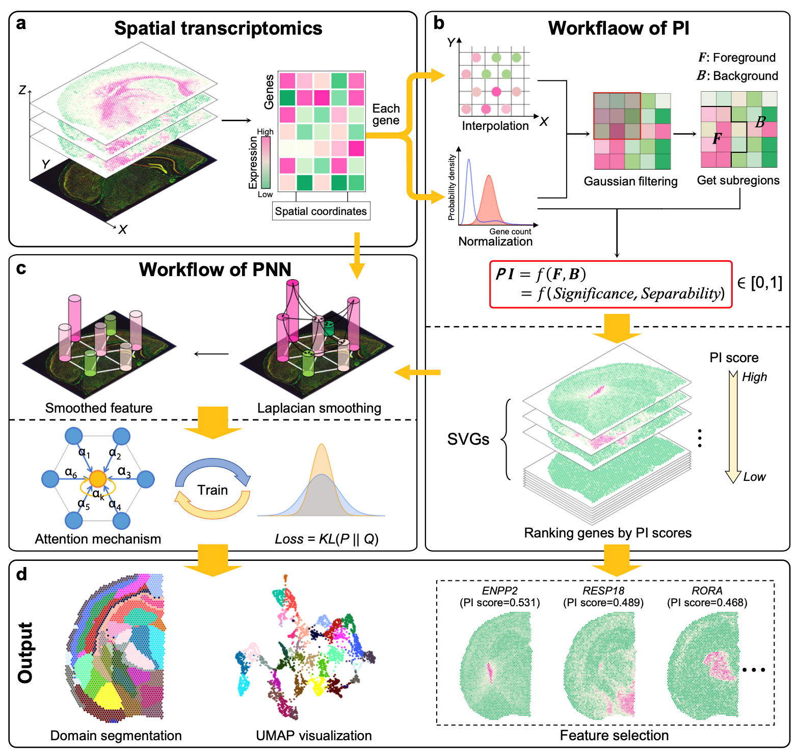

.. PROST documentation master file, created by
   sphinx-quickstart on Fri May  5 17:38:25 2023.
   You can adapt this file completely to your liking, but it should at least
   contain the root `toctree` directive.

PROST: A quantitative pattern recognition framework for spatial transcriptomics 
====================================================================================================================================================================================

**PROST** is a flexible framework to quantify gene spatial expression patterns and detect spatial tissue domains using spatially resolved transcriptomics with various resolutions. `PROST` consists of two independent workflows: **PROST Index (PI)** and **PROST Neural Network (PNN)**.   

Using **PROST** you can do: 

- Quantitative identification of spatial patterns of gene expression changes by the proposed **PROST Index (PI)**.
- Unsupervised identification of spatial tissue domains using a **PROST Neural Network (PNN)**. 

.. toctree::
   :maxdepth: 1
   :caption: Contents:

   Installation
   Easy Start
   How to use PROST
   Tutorial1 DLPFC
   Tutorial2 Stereo-seq
   Tutorial3 SeqFish
   Tutorial4 osmFish
   Tutorial5 simulated osmFish
   Tutorial6 slide-seq
   Tutorial7 PI
   Api

===================================
